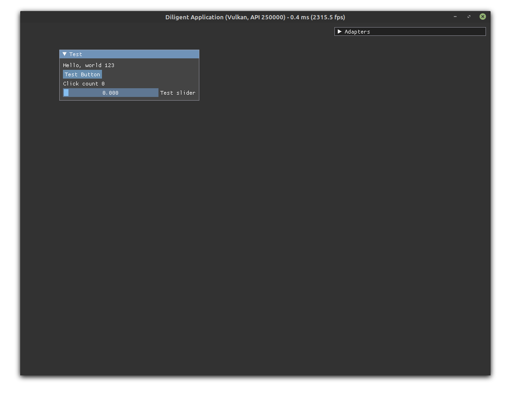

# Minimal Cross Platform Diligent Project Boilerplate 

[DiligentEngine](https://github.com/DiligentGraphics/DiligentEngine) is a very nice game engine, but I could not find a bare minimal reusable project template. So I have created this based on the Samples.

* This is what i did in my limited understanding of the examples from DiligentEngine.
* I am not claiming this is the best way to to this.
* I have renamed anything with the word "sample" to a sensible name.
* Basically I have copied the SampleBase and renamed some things and simplified the cmake script, then I have copied the GLTFViewer demo and removed everything but the very basic required code to start the app with some imgui stuff.
* DiligentEngine is included as a git submodule
* I have tested it only on Linux Mint 19.3

## Usage

```
> git clone https://github.com/mnesarco/minimal-diligent-base-app
> cd minimal-diligent-base-app
> git submodule update --init --recursive
>
> mkdir build
> cd build
> cmake ..
> cmake --build .
```

## Issues / Support / Questions

I am sharing this as an example that can be useful for someone else. But for any support, question, issue or whatever please go to the official Diligent documentation/community.

https://github.com/DiligentGraphics/DiligentEngine

## Screenshot

